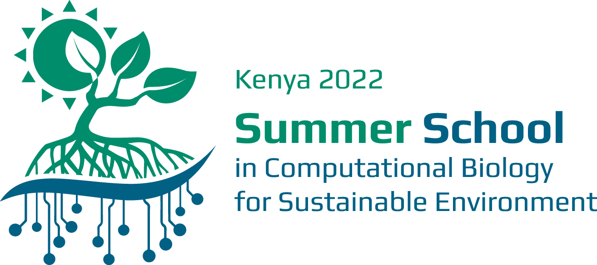

# Summer School

Material for the Mawazo x RWTH: Summer School in Computational Biology for Sustainable Environmental, financed by the VolkswagenStiftung.

## Setting up the development environment

If you have any problems following the [do not hesitate to immediately write an email](mailto:marvin.van.aalst@hhu.de).

It is much easier for us to fix those issues before than during the workshop. Thanks!

- Install Docker Desktop 2.0+, which you can get [here](https://www.docker.com/products/docker-desktop/)
- **If** you are on Windows, you will also need to install [windows subsystem for linux](https://docs.microsoft.com/en-us/windows/wsl/install)
    - You probably just need to run `wsl --install` in an *administrator* command prompt
- Install the [vscode editor](https://code.visualstudio.com/)
- Once all of that is installed, move into the summer school directory and open up vscode (`code` in terminal)
- **If** the official `Remote - Containers` extension if it isn't installed yet:
    - navigate to the Extensions tab on the left hand side
    - search for `ms-vscode-remote.remote-containers`
    - install the extension

Now clone this repository using this link `https://git.rwth-aachen.de/computational-life-science/summer-school.git`.
When you have opened the repo in vscode, a small popup should appear on the lower right corner where you can click "Reopen in Container".
If it doesn't appear or you clicked it away, you can open the command palette with `F1` or `Ctrl + Shift + P` and then write

`> Remote-Containers: Reopen in Container`

- The first time it builds the operating system it might take a while, the next time should be very quick.

